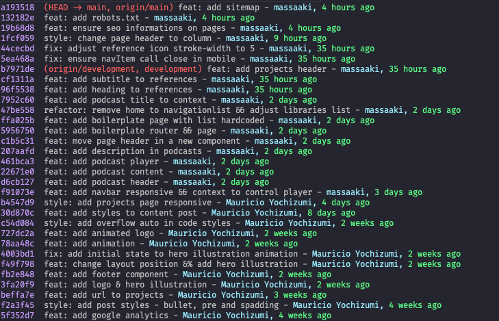

# Git configurations

## Examples

### git status
<p> </p>

### git l
<p></p>


## Configurations
- configure vscode as default editor
- add user informations
- add --wait flag to open editor
- add follow tags automatically in push operations
- add alias with formated code to git status 
- add alias git add && commit
- add alias to git log with reduce informations


## Getting started
### Add vscode to default editor
```
git config --global core.editor code
```

### Open file to edit
```
git config --global --edit
```

### Edit && save
```
# This is Git's per-user configuration file.
[user]
	name = massaaki
	email = eu@massaaki.com
# Please adapt and uncomment the following lines:
#	name = Mauricio Yochizumi
#	email = massaaki@Mauricios-MacBook-Pro.local
[core]
	editor = code --wait
[push]
	followTags = true
[alias]
	s = !git status -s
	c = !git add --all && git commit -m 
	l = !git log --pretty=format:'%C(blue)%h %C(red)%d %C(white)%s - %C(cyan)%cn, %C(green)%cr'
 
```

## Commands
### git add . && git commit -m "commit-message"
```
git c "commit-message"
```

### git log --pretty=format:'%C(blue)%h %C(red)%d %C(white)%s - %C(cyan)%cn, %C(green)%cr'
```
git l
```

### git status -s
```
git s
```
